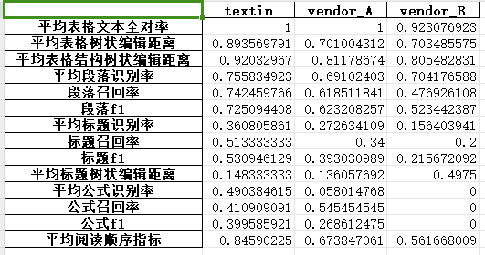
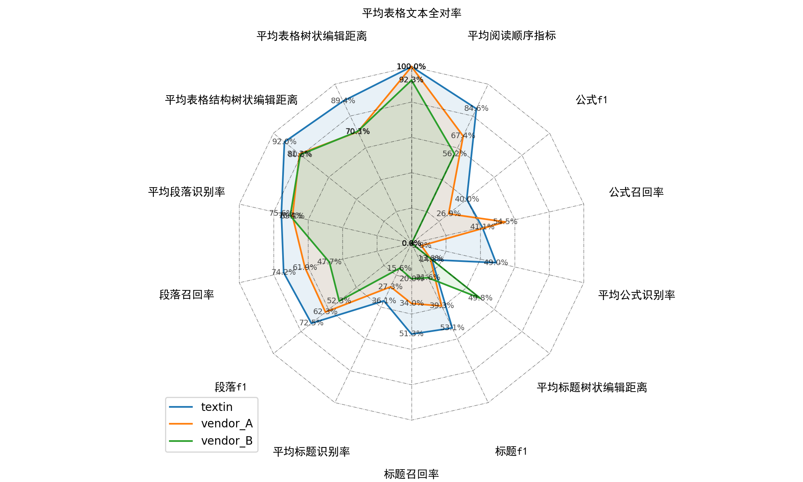

# Markdown Tester

该测评脚本用于评价markdown文档相似性，从段落、标题、表格和公式四个维度进行评价：


| 指标         | 说明                                     |
|------------|----------------------------------------|
| 段落识别率      | 段落匹配的个数（段落编辑距离小于0.2）  /  预测出的总段落数      |
| 段落召回率      | 段落匹配的个数（段落编辑距离小于0.2）/ 总的段落数            |
| 段落f1       | 2 * (段落识别率 * 段落召回率) / (段落识别率 + 段落召回率)  |
| 标题识别率      | 标题匹配的个数（标题编辑距离小于0.2）  /  预测出的总标题数      |
| 标题召回率      | 标题匹配的个数（标题编辑距离小于0.2）/ 总的标题数            |
| 标题f1       | 2 * (标题识别率 * 标题召回率) / (标题识别率 + 标题召回率)  |
| 标题树状编辑距离   | 所有标题树编辑距离分数之和（pred，包含文字）/ 总标题数量（gt）    |
| 表格文本全对率    | 文本全对的表格个数（pred）/  总表格个数（gt）            |
| 表格树状编辑距离   | 所有表格树编辑距离分数之和（pred，包含文字）/ 总表格数量（gt）    |
| 表格结构树状编辑距离 | 所有表格树编辑距离分数之和（pred，不包含文字）/ 总表格数量（gt）   |
| 公式识别率      | 公式匹配的个数（公式编辑距离小于0.2）  /  预测出的总公式数      |
| 公式召回率      | 公式匹配的个数（公式编辑距离小于0.2）/ 总的公式数            |
| 公式f1       | 2 * ( 公式识别率 * 公式召回率) / (公式识别率 + 公式召回率) |
| 阅读顺序指标     | 计算预测值和真值中，所有匹配段落的编辑距离                  |


## 使用方法
- **运行install.sh，安装软件包：**
```bash
./install.sh
```
- **待测评样本按照下述方式放置：**

```
dataset/
├── pred/
│   ├── gpt-4o/
│   ├── vendor_A/
│   ├── vendor_B/
│   ├── ...
├── gt/
```


- **运行下述命令**
- **使用命令如下：**
```bash
python run_test.py --pred_path path_to_pred_md  --gt_path path_to_gt_md
```

其中：
- `path_to_pred_md`：预测值文件所在文件夹。
- `path_to_gt_md`：真值文件所在文件夹。

## 运行效果
**表格**


**雷达图**



